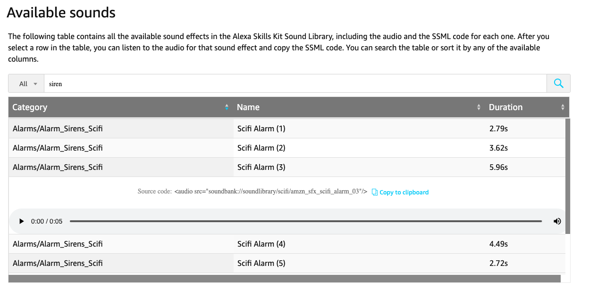

Alexa has a peculiarity about how to reproduce sounds when acting as a media player. Alexa is limited to reproduce sounds that are only in their [directory of sounds](https://developer.amazon.com/es-ES/docs/alexa/custom-skills/ask-soundlibrary.html#available-sounds).

Choose the sound most you like and assign it to the `sound` attribute at yaml. After that figure out at the sound duration and assign the `loop_delay` variable with the track duration.

## Example

Go to [Alexa Skills available sounds](https://developer.amazon.com/es-ES/docs/alexa/custom-skills/ask-soundlibrary.html#available-sounds) and choose one.

Get the sound you like most, in my case `<audio src="soundbank://soundlibrary/scifi/amzn_sfx_scifi_alarm_03"/>`.

After that, get the last part of audio like this: `amzn_sfx_scifi_alarm_03` and assign it to the `sound` attribute in `apps.yaml`

Take a look at the duration of the sound and assign it to the `loop_delay` attribute as: `loop_delay: 5`

!!! tip
    Alexa puts the request in a queue and I recommend truncate the number of track duration. If track duration is 5.96 secs trunc it to 5.
