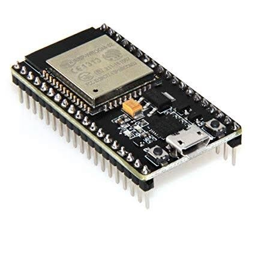
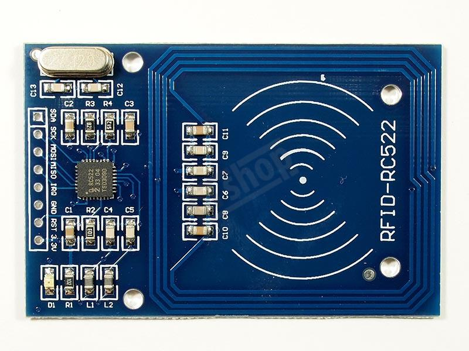
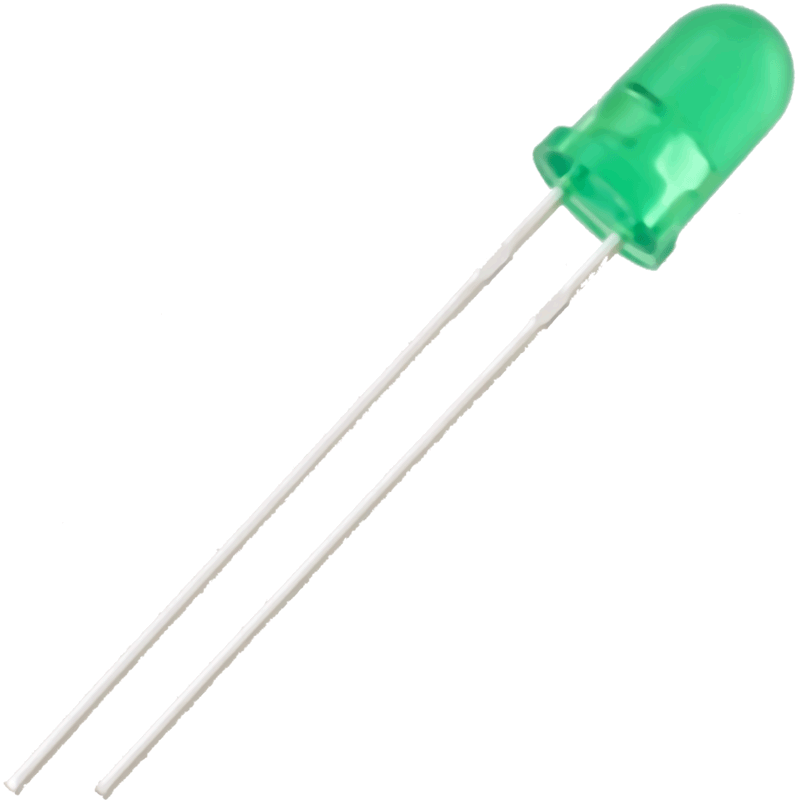
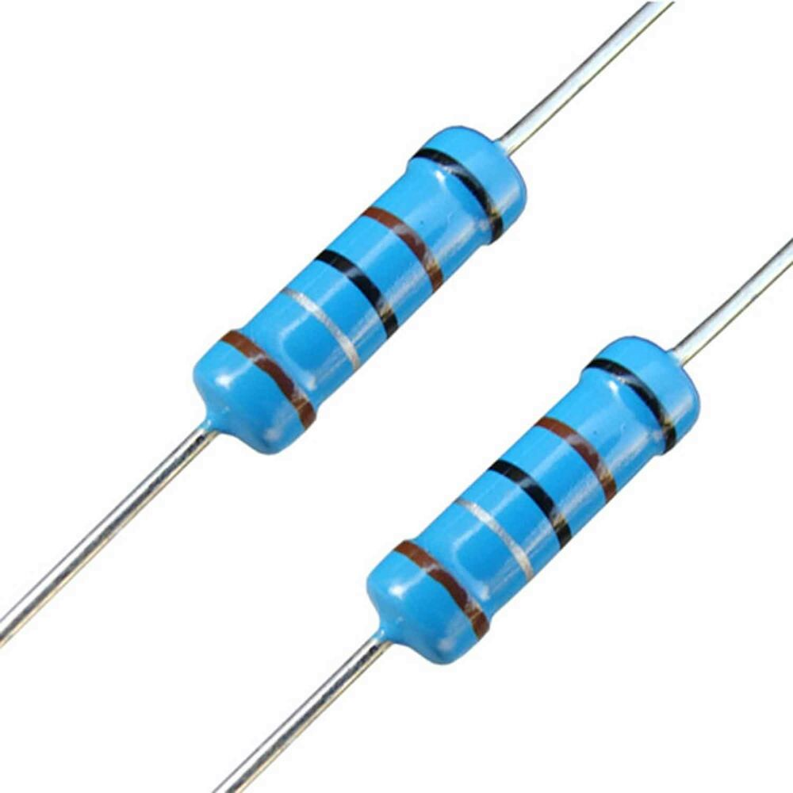
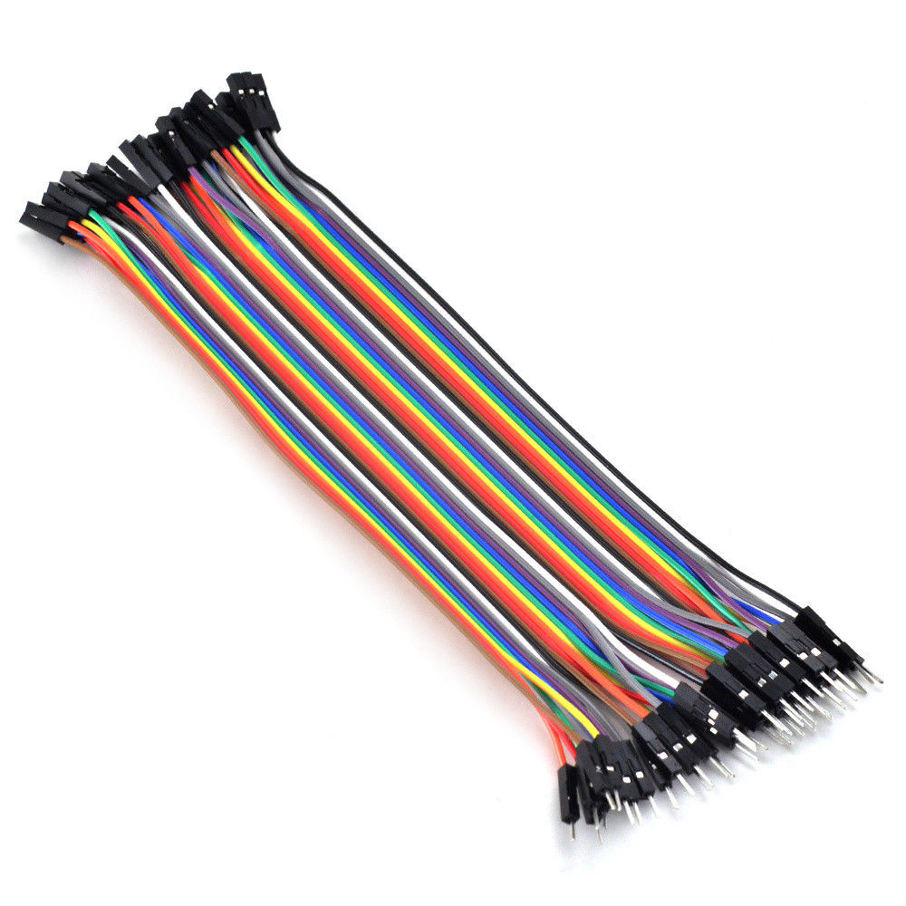
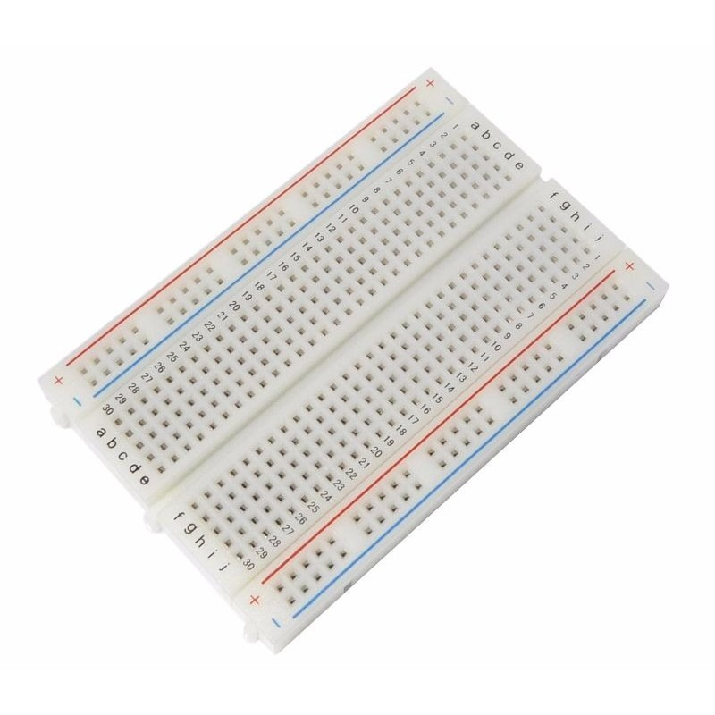
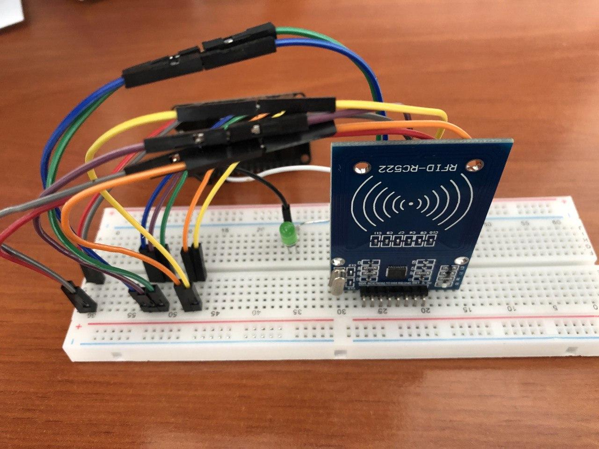
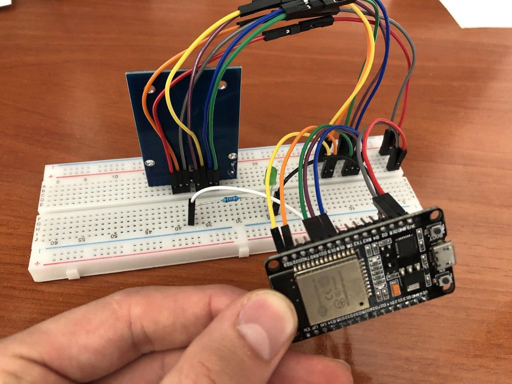
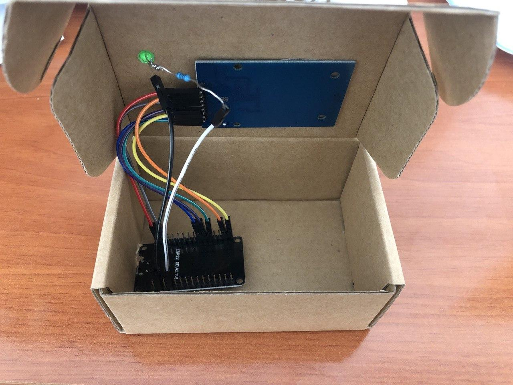
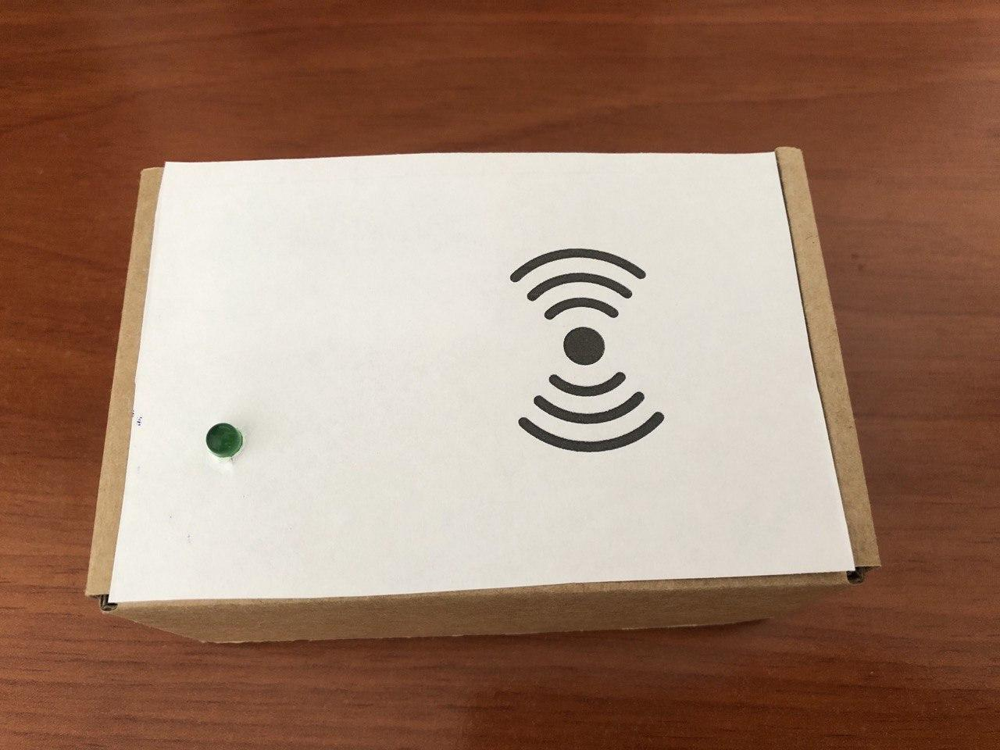

# RFID Identification system

In this section it is shown the RFID identification system and how it works with Home Alarm. It is a handmade system that anyone can make it at their homes using basic and cheap components.

## Components

- ESP32: This is the brain of the system. It is a microcontroller board that connects RFID reader and sends/reads MQTT messages to/from our Home Assitant MQTT broker. 

{: width="200" }

- RC522: RFID Card reader.

{: width="200" }

- RFID Tag: Passive device that identifies a person in the system.

{: width="100" }

- Green LED: Led component to know visually if the `safe_mode` is activated or not.

{: width="100" }

- Resistor 100 Ohms: To limit the intensity passing through the LED.

{: width="100" }

- Jumpers: To wire components.

{: width="100" }

- Protoboard: To connect all the components and test the environment.

{: width="100" }

## Schemas

Left connections:

- **Pin 2 (GND) ESP32 - LED cathode (the shorter leg of the LED)** [black wire]
- **Pin 4 (GPIO12) ESP32 - Resistor 100 Ohms - LED anode (the longer leg of the LED)** [gray wire]

Right connections:

- **Pin 1 (VDD 3V3) ESP32 - 3.3V RC522** [red wire]
- **Pin 2 (GND) ESP32 - GND RC522** [gray wire]
- **Pin 9 (GPIO18) ESP32 - SCK RC522** [violet wire]
- **Pin 10 (GPIO19) ESP32 - MISO RC522** [violet wire]
- **Pin 11 (GPIO21) ESP32 - SDA RC522** [green wire]
- **Pin 14 (GPIO22) ESP32 - RST RC522** [orange wire]
- **Pin 15 (GPIO23) ESP32 - MOSI RC522** [yellow wire]

{: width="325" }
{: width="325" }
{: width="325" }
{: width="325" }

## Installation

For having this system working it is needed the `ESPHome` integration installed in HA, the `safe_mode` input boolean created in HA and the MQTT broker. 

First of all we need to flash our *ESP32* through the *ESPHome* integration. For doing that we have to connect the ESP32 to an USB port from our HA (just for the first load, after that we will be able to flash it through OTA). For flashing correctly the ESP32 it is need two files, the `ESPHome` [configuration file](https://github.com/crserran/home-alarm/blob/dev/rfid/esp_identification.yaml) and our [custom file](https://github.com/crserran/home-alarm/blob/dev/rfid/rc522_sensor.h) that contains all the logic of our app. These files are placed in `/config/esphome/` directory. Alternativelly you can add a secrets.yaml file to that folder to keep save your WiFi and MQTT passwords and others. Once you have it you can flash your ESP32 via USB and remember that some ESP32 the `boot` button has to be pressed to flash the software correclty.

Now you will be able to see two new entities in our Home Assistant that are `rfid_real_time` and `rfid_last_read`. Then, we can add an automation for controlling the `safe_mode` with the `rfid_real_time`. You just need to know the ids of your RFID tags that can be obtained through ESPHome integration and logs. [Add the automation](https://github.com/crserran/home-alarm/blob/dev/rfid/automations.yaml). 

!!! tip
    User can add multiple RFID tags just adding their IDs to the automation file in `value_template` concatenating `or`.

## How it works?

This RFID identification system is a complementary app that can be used with Home Alarm. The purpose of that is to active or disarm the alarm using the RFID system working with the `safe_mode` input. One can activate the House safe mode just moving closer its RFID tag to RFID reader. User will know that the save mode is activated just watching if the green LED is on, otherwise it means that safe mode is not activated.

!!! info
    Remember that for Home Alarm we have a configuration variable that is call `safe_mode_delay` in `apps.yaml`. You can configure this variable to activate your Home safe mode with a delay in order to have time to leave the house. In that time, the alarm won't be fired.

ESP32 is subscribed to an MQTT topic in order to know if the `safe_mode` is activated or not and toggle the LED when the state changes. Our automation created reads the RFID tag id and check if there is a known tag and in positive case publish an MQTT message for activate or deactivate safe mode.

!!! info
    If alarm is fired and you are at home, you can disarm it by moving closer the RFID tag to the reader in order to deactivate the `safe_mode` input.

## Files

- [Configuration file](https://github.com/crserran/home-alarm/blob/dev/rfid/esp_identification.yaml) 
- [ESP32 App](https://github.com/crserran/home-alarm/blob/dev/rfid/rc522_sensor.h) 
- [Automation](https://github.com/crserran/home-alarm/blob/dev/rfid/automations.yaml)

